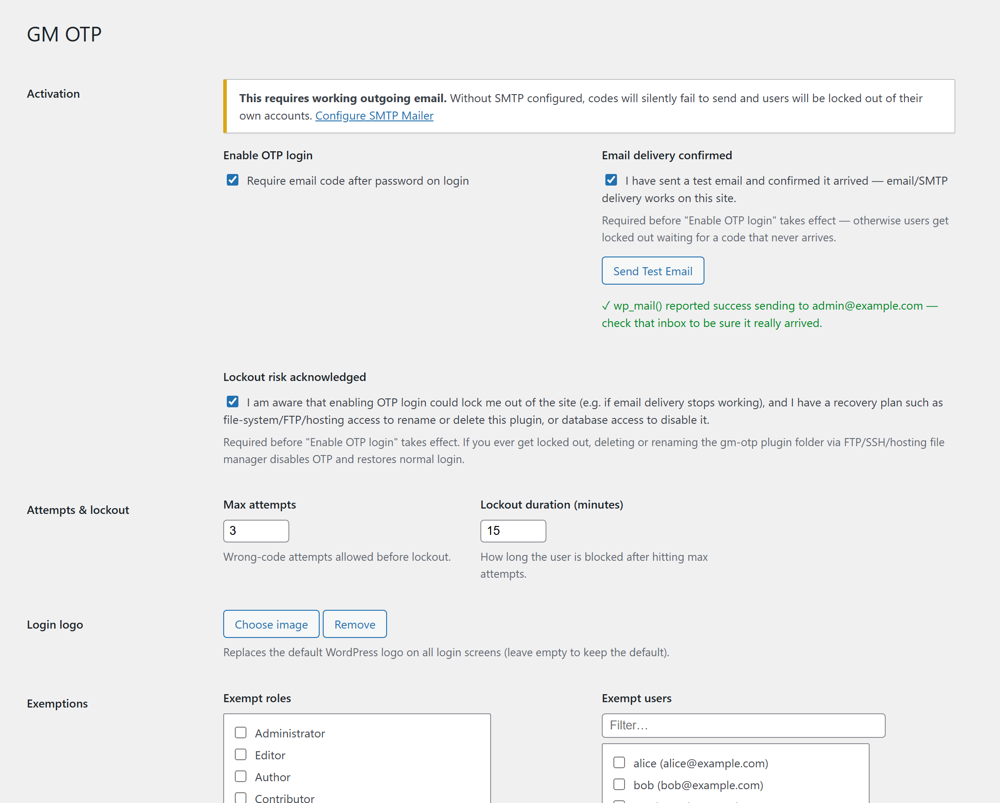
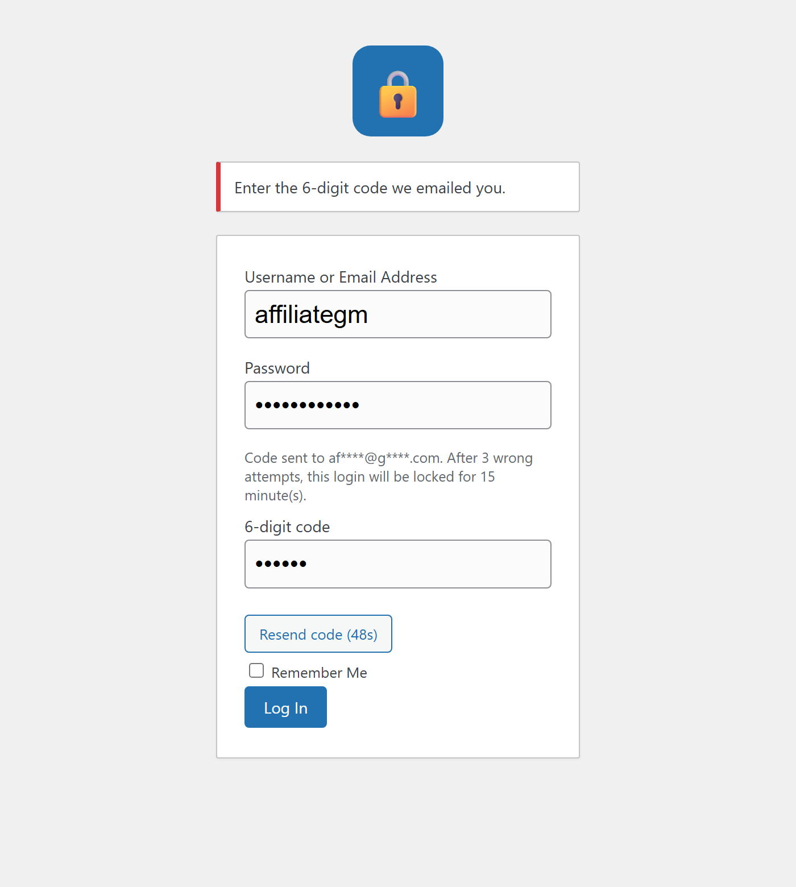
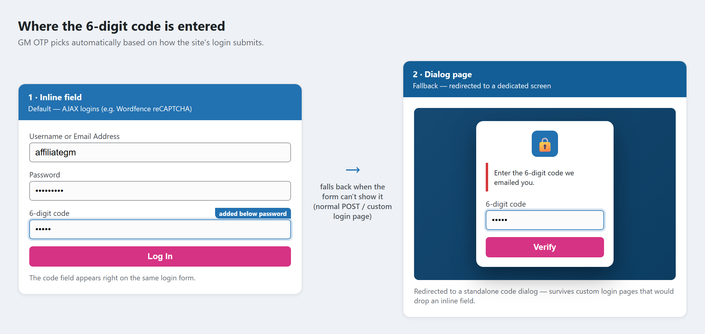

# GM OTP

**Email 2FA for WordPress that just works — no authenticator app, no SMS gateway, no paid tier.**

[](https://github.com/affigabmag/gm-otp/releases)


[](LICENSE)

Email-based one-time-password (OTP) for WordPress login. After a correct
username and password, GM OTP emails the user a 6-digit code and requires it —
as a third field on the same login form — before the login completes. A simple
second factor that needs nothing but working outgoing email.

## Why GM OTP

- **Zero friction to set up** — if the site can send email, it works. No app enrolment, no phone numbers.
- **Plays nicely with the messy real world** — tested against **Wordfence Login Security** (reCAPTCHA + AJAX login) and sites with **custom login pages**; it auto-picks an inline field or a dedicated dialog page depending on the login flow.
- **Won't lock you out by accident** — can't be enabled until you confirm email delivery works and acknowledge the recovery path; if mail ever breaks you disable it by removing the plugin folder.
- **Multisite-aware** — one network-wide switch, or per-site on single installs.
- **No lock-in, no upsell** — GPLv2, one file split into tidy includes, with tests.

- **Version:** 3.18.2
- **Requires WordPress:** 5.8+
- **Tested up to:** 7.0
- **License:** GPLv2 or later
- **Author:** Affiliate GM ([@affigabmag](https://github.com/affigabmag))

## Repository layout

```
gm-otp.php          Bootstrap (header, constants, require_once of includes)
includes/core.php   Logging, log viewer, shared helpers
includes/admin.php  Settings pages, menu, action links, field renderers
includes/login.php  OTP auth flow, inline field, and dialog page
assets/             Dialog-page CSS + screenshots
tests/              Stub-based unit tests (run under plain PHP CLI)
dox/                Developer docs — see below
```

## Docs

- [`dox/ARCHITECTURE.md`](dox/ARCHITECTURE.md) — file/function map, the two login transports, data storage.
- [`dox/HISTORY.md`](dox/HISTORY.md) — how the plugin evolved.
- [`dox/CLAUDE.md`](dox/CLAUDE.md) — conventions, release checklist, environment gotchas.

## Tests

```
php tests/run.php          # captcha bypass, multisite routing, AJAX flow, grace token
php tests/run-dialog.php   # non-AJAX login redirects to the dialog page
```

## Screenshots

**Settings — activation gates, attempts/lockout, login logo, and exemptions**



**Login — the 6-digit code is entered as a field on the login form itself**



**Two ways to enter the code** — inline on the login form (default, incl. AJAX/Wordfence logins), with an automatic fallback to a dedicated dialog page when the form can't show it (normal POST or custom login pages)



## Features

- **6-digit email code after password** — a lightweight second factor, no
  authenticator app or SMS gateway required.
- **Same-page code field** — the code is entered on the login form itself (no
  separate redirect page), which keeps it compatible with AJAX-based login
  flows.
- **Wordfence Login Security compatible** — works alongside Wordfence's
  reCAPTCHA/AJAX login, including a targeted bypass of the `wfls_captcha_verify`
  rejection when the credentials are genuinely valid, plus a single-use grace
  token so the plugin's own gate isn't demanded twice in Wordfence's two-phase
  (admin-ajax → wp-login.php) login.
- **Lockout protection** — configurable max wrong-code attempts and lockout
  duration.
- **Resend with cooldown** — "Resend code" button with a countdown timer.
- **Masked email** — shows where the code was sent without revealing the full
  address.
- **Role & user exemptions** — exclude specific roles or individual users from
  the OTP requirement.
- **Custom login logo** — optional logo on all login screens.
- **Multisite** — a single network-wide switch controls every site, or use it
  per-site on single-site installs.
- **Safety gates before enabling** — OTP login can't be turned on until you
  (1) confirm email delivery works (with a real "Send Test Email" button) and
  (2) acknowledge the lockout risk and that you have a recovery path. The Save
  button stays disabled until both are checked.
- **Built-in log viewer** — the plugin's own log plus a best-effort reader for
  the server's PHP error log, for troubleshooting delivery.

## Installation

### From the WordPress.org Plugin Directory (once approved)

Search for **GM OTP** under *Plugins → Add New*, install, and activate.

### Manual

1. Copy the `gm-otp` folder (containing `gm-otp.php` and `readme.txt`) into
   `wp-content/plugins/`.
2. Activate **GM OTP** from *Plugins* (or *Network Activate* on multisite).
3. Configure under the **GM OTP** admin menu (or *Network Admin → Settings →
   GM OTP* on multisite).

## Setup

Before enabling OTP login:

1. **Configure outgoing email/SMTP.** Codes are sent with `wp_mail()`. Without
   reliable delivery, users would be locked out waiting for a code that never
   arrives. An SMTP plugin (e.g. *SMTP Mailer*) is strongly recommended.
2. On the settings page, click **Send Test Email** and confirm it arrives, then
   check **Email delivery confirmed**.
3. Check **Lockout risk acknowledged** — confirming you understand you could be
   locked out and have a recovery path.
4. Only now can you check **Enable OTP login** and save.

## If you get locked out

OTP is enforced only while the plugin is active. To recover, disable it by any
of:

- Deleting or renaming the `gm-otp` plugin folder via FTP/SFTP/SSH or your
  host's file manager.
- Deactivating it in the database (`wp_options` → set `gm_otp_enabled` to `0`,
  or delete the row).

## How it works

GM OTP hooks the WordPress `authenticate` filter at priority 30 (after core has
validated the username/password). On valid credentials with no pending code, it
generates a code, stores it in a transient keyed by a cookie token, emails it,
and returns a `WP_Error` that re-renders the login form with the code field
revealed. When the correct code is submitted, it returns the `WP_User` and core
completes the login normally.

## Changelog

See [`readme.txt`](readme.txt) for the full changelog. Highlights:

- **3.12.x** — three-column activation layout; Save button gated until both
  confirmation boxes are checked.
- **3.11.x** — top-level admin menu; "Settings" link on the Plugins list;
  Enter-to-submit in the code field; VERSION file in build artifacts.
- **3.10.0** — lockout-risk acknowledgement gate.
- **3.8.x** — same-page 3-field design; Wordfence reCAPTCHA/AJAX compatibility
  and grace-token fix.
- **3.0.x–3.6.0** — role/user exemptions, login logo, log viewer, SMTP gate,
  WordPress.org readiness.

## FAQ

**Does it need an authenticator app or SMS?**
No. The code is emailed. All you need is working outgoing mail (an SMTP plugin is recommended).

**What if email breaks and I'm locked out?**
OTP is only enforced while the plugin is active. Delete or rename the `gm-otp`
folder via FTP/SSH/hosting file manager (or flip `gm_otp_enabled` off in the
database) and normal login returns. The settings page makes you acknowledge
this before enabling.

**Does it work with Wordfence?**
Yes. It bypasses Wordfence's own `wfls_captcha_verify` rejection when the
credentials are genuinely valid, and handles its two-phase (admin-ajax →
wp-login.php) login with a single-use grace token.

**My site uses a custom login page — will the code field show?**
For normal (non-AJAX) logins GM OTP redirects to a dedicated code dialog page,
so it works even when a custom login page would drop an inline field.

**Multisite?**
Yes — a single network-wide switch controls every site (Network Admin →
Settings → GM OTP).

**Can I exempt some users?**
Yes — exempt by role or by individual user.

## Contributing

Issues and PRs welcome — see [`CONTRIBUTING.md`](CONTRIBUTING.md). Run the test
suite with `php tests/run.php`. To report a security issue, see
[`SECURITY.md`](SECURITY.md).

## License

GPLv2 or later. See [`LICENSE`](LICENSE).
